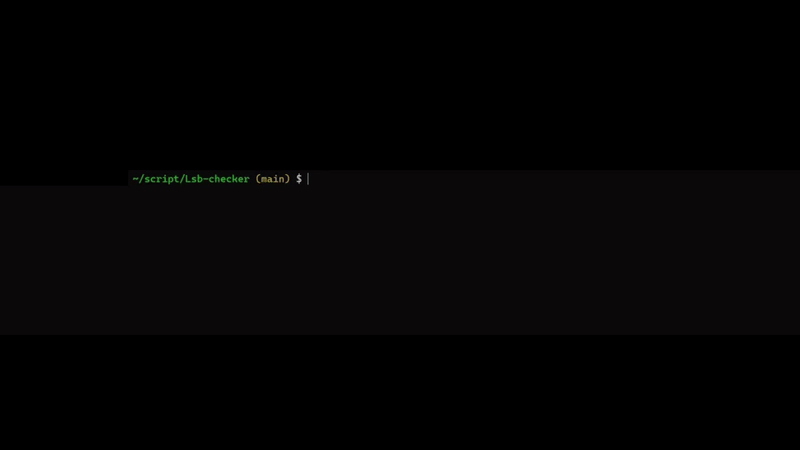

# Lsb-checker

**Lsb-checker** est un outil permettant d’extraire un message caché dans une image à l’aide de la technique de stéganographie **LSB (Least Significant Bit)**.  
Il a été conçu pour offrir une grande flexibilité lors de la récupération du message, notamment en permettant de choisir l’emplacement, les bits utilisés ou encore la direction de lecture.


## Installation 

L'installation de Lsb-checker est très simple et se base sur python3 et le repository GitHub :
```
https://github.com/Alopsis/Lsb-checker
cd Lsb-checker
python3 -m venv dep
source ./dep/bin/activate
python3 -p {pas} -b {Option bit analysé} -d {direction} -i {chemin vers une image}
```

## Exemple 

Lors du HeroCTF v6, il y avait un challenge ou il fallait utiliser la technique du least significiant Bit pour retrouver le flag : 
```
python3 lsb.py  -b b -d diagonale -i ./exemple/secret.png
```



## Fonctionnalités

Lsb-checker propose plusieurs options permettant d’adapter l’analyse en fonction de la méthode de dissimulation utilisée :

- **Pas de lecture personnalisable**
- **Sélection des bits à analyser (R, G, B)**
- **Direction de lecture modifiable**

---

## 1. Le pas de lecture

Le *pas* correspond à l’intervalle entre les pixels analysés.  
Cette fonctionnalité permet, par exemple, de contrer certaines méthodes de dissimulation où le message est inséré tous les 2 ou 3 pixels.

- Utilisation : `-p N`  
  Avec `N` le pas souhaité.  
  **Valeur par défaut : 1**

---

## 2. Les bits analysés

Certains messages peuvent être cachés uniquement dans un canal couleur (par exemple uniquement dans le Bleu).  
Lsb-checker permet donc de sélectionner précisément les bits à inspecter :

- `-b r` : analyse uniquement du canal **Red**
- `-b g` : analyse uniquement du canal **Green**
- `-b b` : analyse uniquement du canal **Blue**
- `-b a` : analyse de **tous** les canaux (Red → Green → Blue)

---

## 3. La direction de lecture

La direction dans laquelle le message a été inscrit peut varier. Lsb-checker permet de choisir entre plusieurs directions :

- `-d diagonale` : lecture en diagonale
- `-d droite` : lecture horizontale vers la droite
- `-d bas` : lecture verticale vers le bas

---

## 4. Les coordonnées de départ

Les coordonnées de départ auquel le message va commencer. Lsb-checker permet de choisir le début du decodage : 

- `-pX 1` : lecture du message à partir du pixel X 1
- `-pY 1` : lecture du message à partir du pixel Y 1
